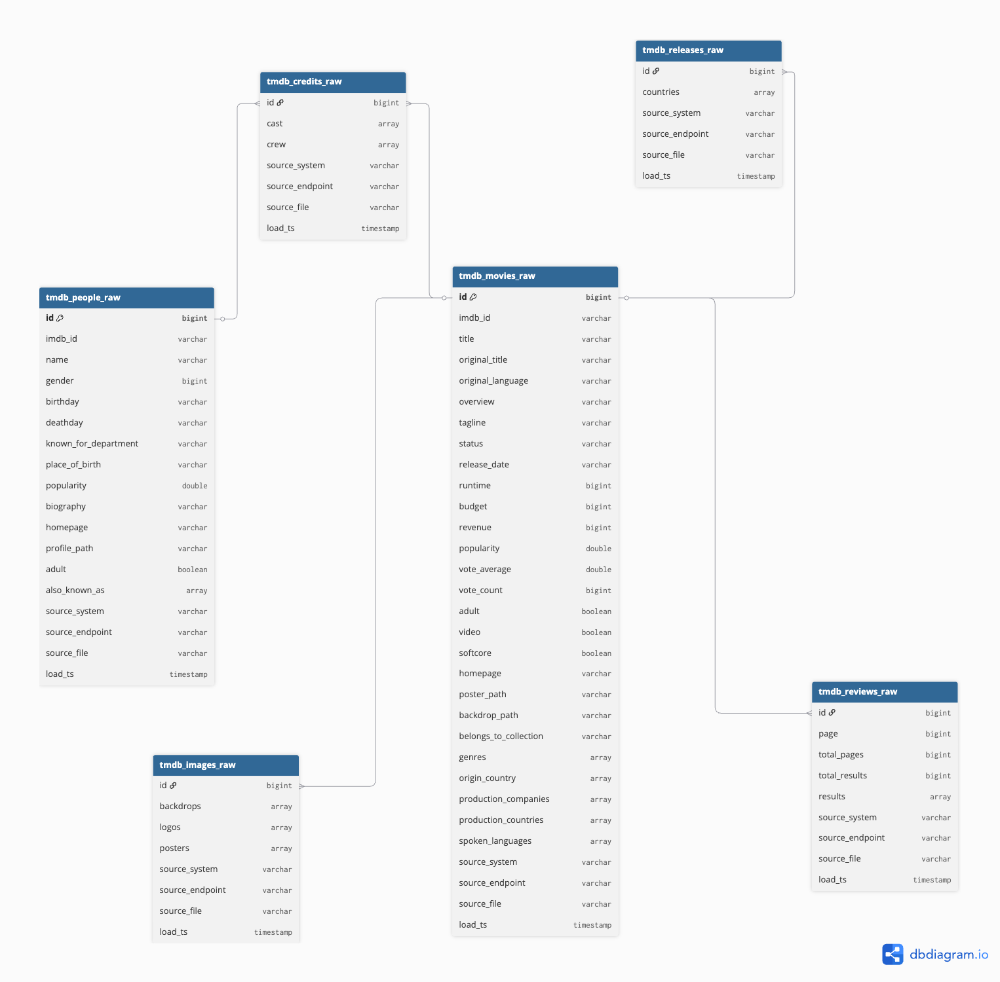
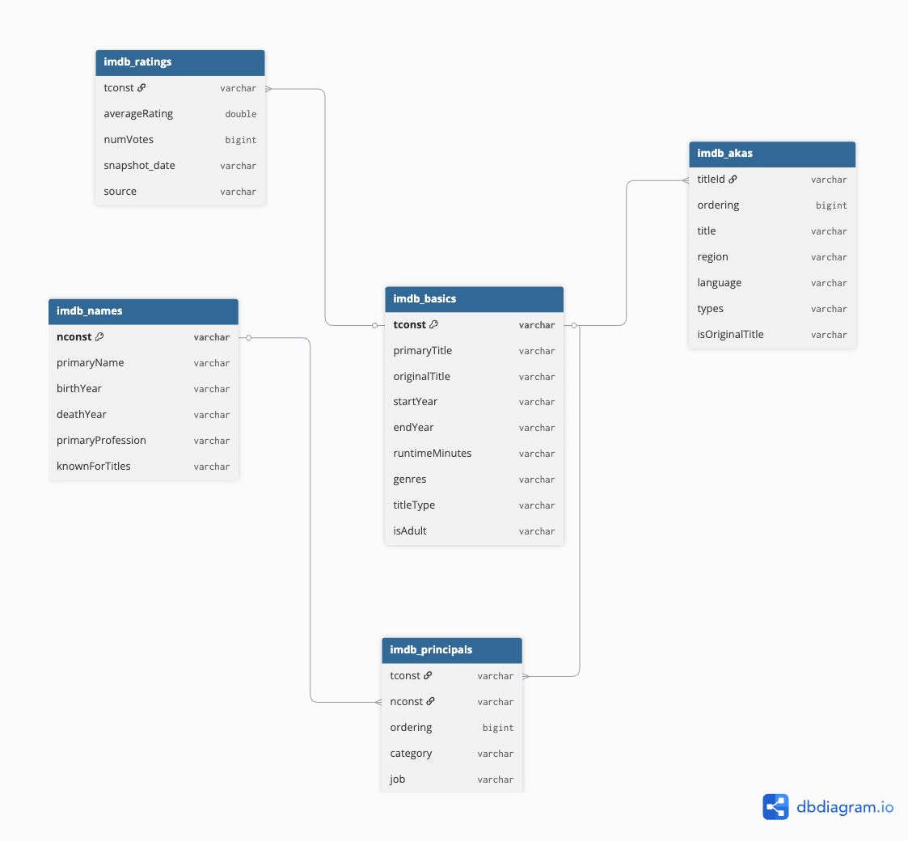
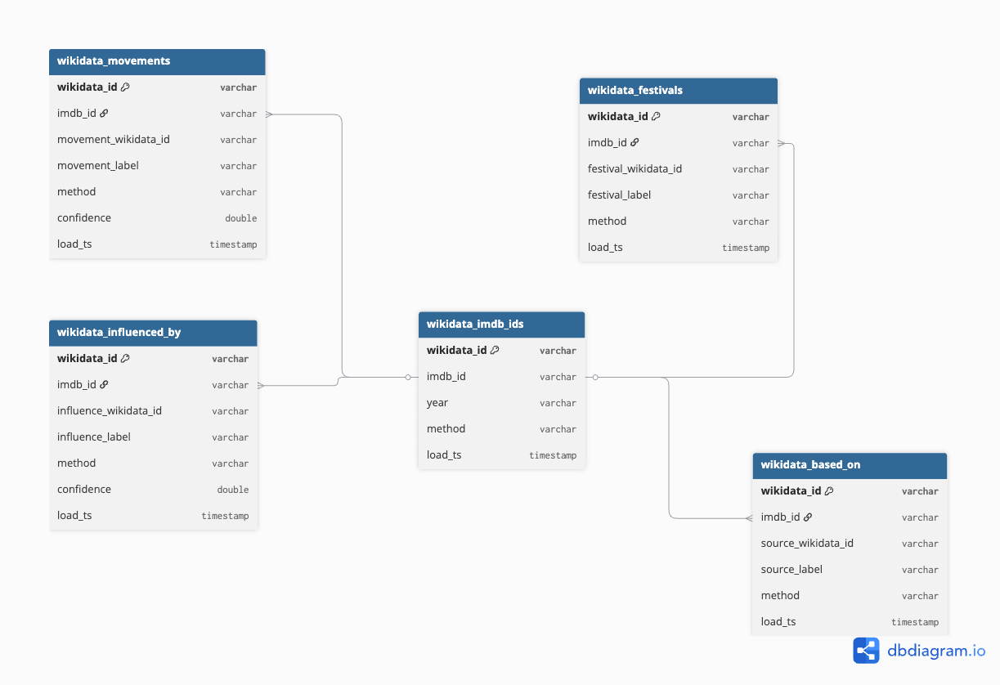
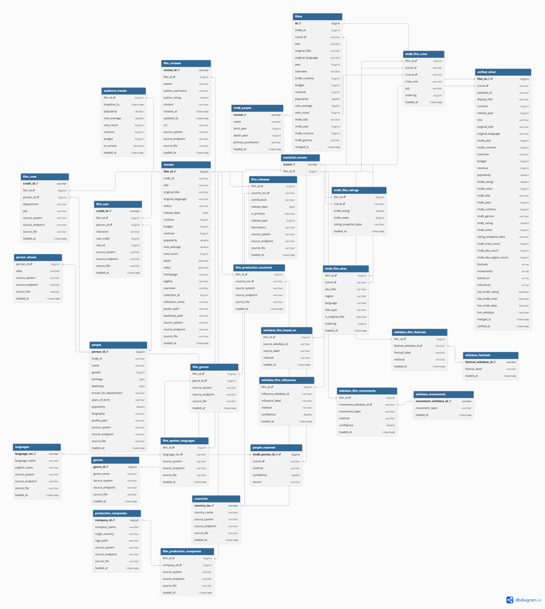
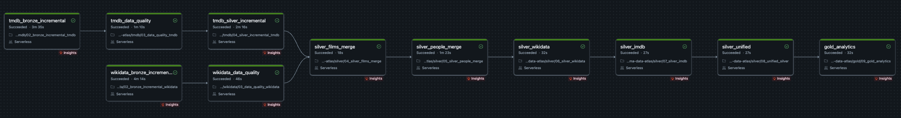

# Cinema Atlas
 
A multi-source data architecture project for film knowledge graphs, temporal popularity analytics, and audience behavior insights.
 
---
 
## Overview
 
Cinema Atlas models cinema as a connected analytical platform — a system of relationships between movies, people, genres, companies, ratings, cultural movements, and temporal popularity signals. It runs an end-to-end medallion pipeline from raw API and public-dataset sources, validates and resolves entities across sources, and unifies them into a single film-grain table surfaced through a Next.js web app.
 
**Analytical questions it supports:** strongest connection paths between two films; hub directors/themes/eras that bridge clusters; box-office and rating evolution over time; nearest thematic neighbors regardless of genre; explainable relationship-based recommendations.
 
---
 
## Architecture
 
```
TMDB API          IMDb TSV.gz           Wikidata SPARQL
  ▼                 ▼                       ▼
AWS S3 / Databricks Volumes  ── raw JSON / JSONL staging
  ▼
BRONZE   workspace.bronze.{tmdb,imdb,wikidata}_*      (append-only raw)
  ▼  dedup + validate  →  *_validated / *_quarantine
SILVER   workspace.silver.*                           (per-source + cross-source merge)
  ▼  unify
         workspace.silver.unified_silver              (one row per film, all sources)
  ▼
Next.js web app (cinema_atlas_next)
```
 
**Single catalog:** all Bronze and Silver tables live in `workspace`. Sources are bridged on the IMDb identifier (`tmdb.imdb_id == imdb.tconst == wikidata.imdb_id`).
 
**Stack:** AWS S3 · Databricks (Unity Catalog, Delta Lake, Volumes, serverless Spark, Workflows) · TMDB API · IMDb datasets · Wikidata SPARQL · rapidfuzz · Next.js · Cytoscape.js · Recharts
 
---
 
## ER Diagrams
 
### TMDB Bronze

 
### IMDb Bronze

 
### Wikidata Bronze

 
### Unified Silver (all sources)

 
---
 
## Data Sources
 
| Source | Type | Scope | Role |
|---|---|---|---|
| **TMDB** | REST API (per-film JSON) | 2000–2026, `vote_count >= 200` historical; all new releases | Primary spine — titles, cast/crew, genres, metrics, box office |
| **IMDb** | Public TSV.gz bulk (no API key) | Movies `startYear >= 2000`; 5 below-the-line crew roles | Ratings time-series, alternate titles, crew |
| **Wikidata** | SPARQL (`query.wikidata.org`) | Films with an IMDb ID, released ≥ 2000 | Cultural context — movements, festivals, source material, influences (intentionally sparse) |
 
---
 
## Data Quality: Bronze → Silver
 
The pipeline never mutates raw data. Quality is enforced as data promotes through layers.
 
**Bronze (append-only).** Every run appends rows stamped with `load_ts`, preserving full history. Nothing is overwritten, so the raw landing zone is always auditable and re-runnable.
 
**Validation (Bronze → `_validated` / `_quarantine`).** Each source has a dedicated DQ notebook that:
- **Dedupes** to the latest snapshot per key using a `load_ts` window (e.g. latest per `id` for TMDB, latest per `(wikidata_id, property_id)` for Wikidata).
- **Hard checks → quarantine.** Rows missing required keys (null `id`, null `tconst`, null `wikidata_id`) are routed to a `_quarantine` table with a `fail_reason` and `dq_run_date`, never silently dropped.
- **Soft checks → log.** Out-of-range values (bad dates, votes outside 0–10, malformed `imdb_id`, year outside 2000–2030) are counted and logged but kept, so legitimate edge cases aren't lost.
- Writes a clean `_validated` table (overwrite) plus an appended `_quarantine` audit trail.
A concrete example: Wikidata returns duplicate triples when a film has multiple `P577` publication dates — one film inflated to 30 identical festival rows. The composite-key dedupe collapses these to the true unique pairs (e.g. festivals: 7,575 raw → 1,684 validated), and the duplication is a data artifact, not a pipeline bug.
 
**Silver (validated → modeled).** Validated tables feed the Silver layer, which applies SCD logic and cross-source resolution:
- **SCD Type 1** — most TMDB dim/fact tables hold current state, updated in place via MERGE.
- **SCD Type 2** — `audience_trends` and `imdb_ratings` preserve every timestamped snapshot for time-series analysis.
- **Provenance flags** — `unified_silver` carries `has_imdb_rating`, `has_imdb_crew`, `has_imdb_akas`, `has_wikidata` so downstream consumers can filter on data completeness explicitly.
---
 
## Pipeline
 

 
One Databricks Workflow (`cinema-atlas-pipeline`). TMDB and Wikidata Bronze branches run **in parallel**, merging into the Silver chain once both complete.
 
```
TMDB:     02_bronze_incremental → 03_data_quality → 04_silver_incremental ┐
                                                                          ├→ Silver
Wikidata: 02_bronze_incremental → 03_data_quality ────────────────────────┘
```
 
**Silver chain:**
```
04_silver_films_merge → 05_silver_people_merge → 06_silver_wikidata → 07_silver_imdb → 08_unified_silver
```
 
- **`04_silver_films_merge`** — inner-joins TMDB (latest snapshot) to IMDb basics on `imdb_id == tconst`; writes `films` (10,221 matched) + `matched_tconsts` (the bridge every downstream notebook uses).
- **`05_silver_people_merge`** — 2-pass entity resolution: direct `imdb_id → nconst` (65,541), then film-anchored rapidfuzz name match ≥ 90 (1,800 more); records `method` + `confidence`.
- **`06_silver_wikidata`** — joins 5 validated Wikidata tables to `matched_tconsts`, producing movement/festival dimensions + film-bridge tables.
- **`07_silver_imdb`** — `imdb_film_ratings`, `imdb_film_crew`, `imdb_people`, `imdb_film_akas`, scoped to matched films.
- **`08_unified_silver`** — one row per film: reconciled canonical fields (`display_title`, `runtime`, `release_year` via coalesce), all source columns, Wikidata arrays, IMDb enrichment counts, and provenance flags.
---
 
## Key Tables
 
**Bronze** — `tmdb_*`, `imdb_*`, `wikidata_*` (append-only raw + `_validated` / `_quarantine`).
 
**Silver**
 
| Table | Grain | Notes |
|---|---|---|
| TMDB star schema (16 tables) | per entity | `movies`, `people`, bridges; `audience_trends` is SCD2 |
| `films` / `matched_tconsts` | film / tconst | TMDB ⨝ IMDb spine + join bridge (10,221) |
| `people_resolved` | person | 2-pass resolution; method + confidence |
| `imdb_film_ratings/crew/akas`, `imdb_people` | film / person | IMDb enrichment scoped to matched films |
| `wikidata_movements/festivals` + film bridges | dimension / bridge | movements, festivals, based_on, influences |
| `unified_silver` | film | flat table, all sources in one row (10,221) |
 
---
 
## unified_silver Coverage
 
| Metric | Count | Coverage |
|---|---|---|
| Total films | 10,221 | — |
| With Wikidata ID | 8,892 | 87% |
| With IMDb rating | 10,017 | 98% |
| With IMDb crew | 10,157 | 99% |
| With IMDb akas | 10,214 | 99% |
| With based_on | 2,135 | 21% |
| With festivals | 153 | 1.5% |
 
---
 
## Entity Resolution
 
- **Films:** exact inner join `tmdb.imdb_id == imdb.tconst` → only films in both sources reach `films`.
- **People:** `person_id` and `nconst` rarely share a key, so resolution is 2-pass — direct `imdb_id` match, then film-anchored fuzzy name match (rapidfuzz ≥ 90). `method` + `confidence` recorded.
- **Wikidata:** resolved via `wikidata_imdb_ids.imdb_id = matched_tconsts.tconst`, mapping `wikidata_id` to `film_id`.
---
 
## Web Application (`cinema_atlas_next`)
 
Next.js app querying Databricks via the SQL Statement Execution REST API (`fetch()`, no Python connector — avoids macOS SSL/Thrift issues).
 
**Pages:** `/` (overview), `/search`, `/film/[id]` (profile + live TMDB trailer + box-office series), `/analytics` (leaderboards + genre charts), `/graph/[id]` (Cytoscape.js connection graph with person filmography expansion).
 
```bash
cd cinema_atlas_next
npm install        # then create .env.local with Databricks + TMDB credentials
npm run dev
```
 
---
 
## Repository Structure
 
```
cinema-atlas/
├── cinema_atlas_next/          Next.js web app (app/ + lib/databricks.js)
├── notebooks/
│   ├── tmdb/       02_bronze_incremental · 03_data_quality · 04_silver_incremental
│   ├── imdb/       01_bronze_ingest_historical · 02_bronze_incremental · 03_data_quality
│   ├── wikidata/   01_bronze_ingest_historical · 02_bronze_incremental · 03_data_quality
│   └── silver/     04_films_merge · 05_people_merge · 06_wikidata · 07_imdb · 08_unified_silver
├── docs/images/    tmdb_bronze · imdb_bronze · wikidata_bronze · unified_silver · cinema_atlas_pipeline
└── README.md
```
 
---
 
## Configuration Reference
 
| Setting | Value |
|---|---|
| S3 bucket / region | `de-cinema-atlas-data` / `us-east-2` |
| Catalog | `workspace` |
| TMDB / IMDb refresh window | 540 days / 2 years |
| Wikidata watermark | `MAX(load_ts)` per table |
| Fuzzy name-match threshold | rapidfuzz token_sort_ratio ≥ 90 |
 
Credentials live in Databricks secret scopes (`cinema-atlas`, `cinema_atlas`) and `.env.local` for the web app.
 
---
 
## Monitoring
 
```sql
-- Wikidata table health
SELECT 'imdb_ids' tbl, COUNT(*) rows, MAX(load_ts) last_load FROM workspace.bronze.wikidata_imdb_ids
UNION ALL SELECT 'festivals', COUNT(*), MAX(load_ts) FROM workspace.bronze.wikidata_festivals
UNION ALL SELECT 'based_on',  COUNT(*), MAX(load_ts) FROM workspace.bronze.wikidata_based_on;
 
-- Unified Silver cross-source coverage
SELECT COUNT(*) total,
       SUM(CASE WHEN has_imdb_rating THEN 1 ELSE 0 END) with_rating,
       SUM(CASE WHEN has_wikidata    THEN 1 ELSE 0 END) with_wikidata
FROM workspace.silver.unified_silver;
 
-- People resolution breakdown
SELECT method, COUNT(*) FROM workspace.silver.people_resolved GROUP BY method ORDER BY 2 DESC;
```
 
---
 
## Team
 
Aatish Lobo · Kaio Farkouh · Tianyi Luo