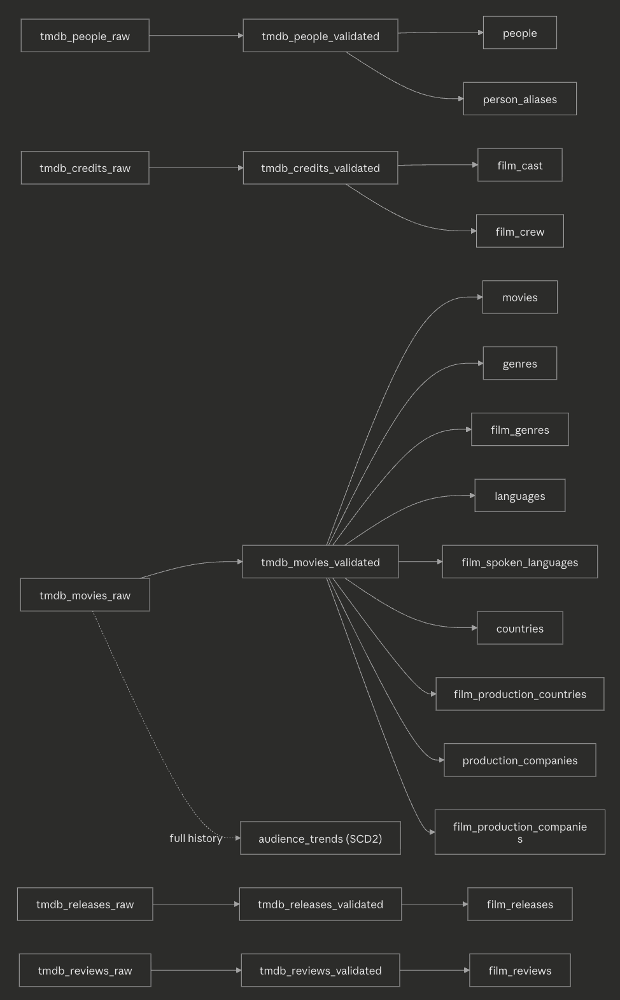
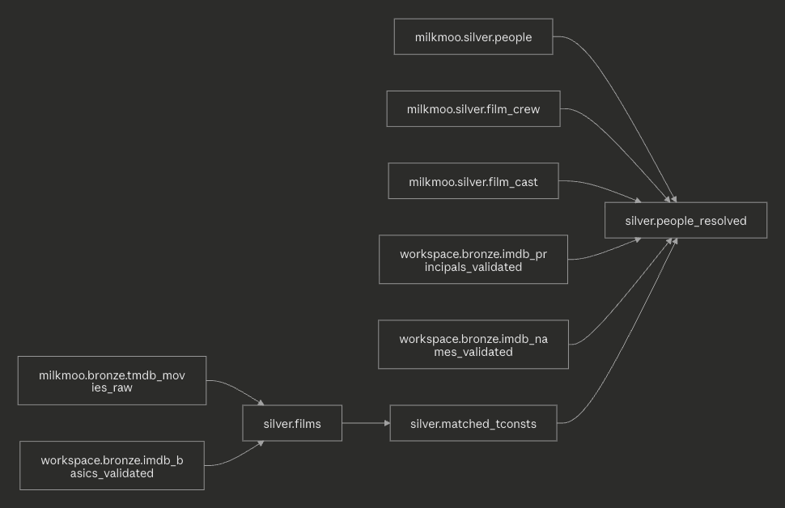
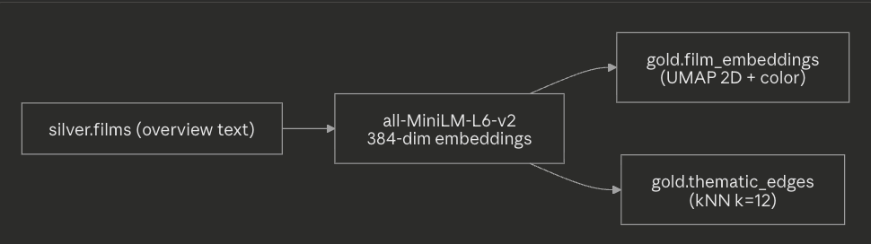

# Cinema Atlas

A multi-source data architecture project for film knowledge graphs, temporal popularity analytics, and audience behavior insights.

---

## Project Overview

Cinema Atlas models cinema as a connected analytical platform — not isolated records, but a system of relationships between movies, people, genres, production companies, audience ratings, cultural movements, and temporal popularity signals. The project builds an end-to-end pipeline from raw API and public-dataset sources through a medallion lakehouse, resolves entities across sources, derives a thematic embedding map, and surfaces everything through a Next.js web application with film profiles, analytics, and an interactive connection graph.

### Analytical questions the platform supports

- What are the strongest paths linking two films — shared crew, genre, country, or cultural movement?
- Which directors, themes, or eras act as hubs that bridge otherwise distant clusters of film?
- How did a film's box office, popularity, and audience ratings evolve over time?
- Which films are thematically nearest to a given film, regardless of genre label?
- Can relationship paths explain a recommendation, not just rank it by rating similarity?

---

## Architecture

```
TMDB API          IMDb Public Datasets        Wikidata SPARQL
  │ tmdbsimple      │ requests + gzip TSV        │ SPARQL endpoint
  ▼                 ▼                            ▼
AWS S3  ── raw JSON / JSONL, source of truth
  │        de-cinema-atlas-data/bronze/{tmdb,imdb,wikidata}/
  ▼
Databricks Volumes  ── staging .jsonl per endpoint per run
  ▼
BRONZE
  milkmoo.bronze.tmdb_*          (TMDB — teammate's catalog)
  workspace.bronze.imdb_*        (IMDb)
  workspace.bronze.wikidata_*    (Wikidata)
  ▼  (dedup + validate)
  *_validated / *_quarantine
  ▼  (transform + cross-source merge)
SILVER
  milkmoo.silver.*               (TMDB normalized star schema)
  workspace.silver.films         (TMDB ⨝ IMDb on imdb_id == tconst)
  workspace.silver.people_resolved  (entity resolution, 2-pass)
  workspace.silver.matched_tconsts
  ▼  (embeddings + kNN)
GOLD
  workspace.gold.film_embeddings (UMAP 2D layout + positional color)
  workspace.gold.thematic_edges  (kNN thematic neighbor graph)
  ▼
Next.js web app (cinema_atlas_next)
```

**Two catalogs:** TMDB lives in `milkmoo` (teammate's catalog); IMDb, Wikidata, and all merged Silver/Gold tables live in `workspace`. The Silver merge layer bridges them on the IMDb identifier (`tmdb.imdb_id == imdb.tconst`).

**Stack:** AWS S3 · Databricks (Unity Catalog, Delta Lake, Volumes, serverless Spark, Workflows) · TMDB API · IMDb datasets · Wikidata SPARQL · sentence-transformers · UMAP · rapidfuzz · Next.js · Cytoscape.js · Recharts

---

## Data Lineage

Lineage is traced directly from the pipeline code. Each source lands in Bronze, is validated, then flows into Silver; the merge layer joins sources on the IMDb identifier, and Gold derives the thematic map from the merged film table.

### TMDB → Silver star schema (`milkmoo`)
Each TMDB endpoint follows the same `raw → validated → silver` path. The `movies` endpoint fans out into the largest set of dimension/bridge tables; `audience_trends` is built from the full `tmdb_movies_raw` history (not the deduped validated table) to preserve every metric snapshot.


### Cross-source merge → `workspace.silver`
`films` is the inner join of TMDB (latest snapshot per film) and IMDb basics on `imdb_id == tconst`. `people_resolved` resolves TMDB people to IMDb crew in two passes, scoped to the matched films.


### Gold → thematic map (`workspace.gold`)


---

## Data Sources

### TMDB (The Movie Database)
- **Type:** REST API, per-film JSON
- **Scope:** 2000–2026, `vote_count >= 200` (historical); all new releases (incremental)
- **Endpoints:** movie info, credits, images, releases, reviews, people
- **Role:** Primary spine — canonical titles, cast/crew, genres, metrics, box office

### IMDb
- **Type:** Public TSV.gz bulk downloads (`datasets.imdbws.com`), no API key
- **Scope:** Movies, `startYear >= 2000`; crew limited to 5 below-the-line roles
- **Files:** `title.basics`, `title.ratings`, `title.akas`, `title.principals`, `name.basics`
- **Role:** Authoritative ratings time-series, alternate titles, below-the-line crew

### Wikidata
- **Type:** SPARQL queries against `query.wikidata.org`
- **Scope:** Films (`wdt:P31 wd:Q11424`) with an IMDb ID, released ≥ 2000
- **Properties:** IMDb ID (P345), movement (P135), festival (P5072), based-on (P144), influenced-by (P737)
- **Role:** Cultural/relational context — movements, festival circuit, source material, influence links. Coverage is intentionally sparse (seed set for relationship inference, not a complete table).

---

## Pipelines

### TMDB (catalog: `milkmoo`)

Three notebooks, run sequentially as a Workflow:

```
02_bronze_incremental  →  03_data_quality  →  04_silver_incremental
```

- **`02_bronze_incremental`** — discovers new films since `MAX(release_date)` (guarded against re-ingesting films already in Bronze) and refreshes metrics for films released in the last 18 months. Appends snapshots stamped with `load_ts`.
- **`03_data_quality`** — dedupes to latest snapshot per `id`, validates, writes `tmdb_*_validated` / `tmdb_*_quarantine`.
- **`04_silver_incremental`** — SCD1 MERGE for 15 dim/fact tables; SCD2 rebuild of `audience_trends`.

### IMDb (catalog: `workspace`)

```
01_bronze_ingest_historical_imdb  →  02_bronze_incremental_imdb  →  03_data_quality_imdb
```

- **`01` (one-time)** — downloads all five TSV.gz files, filters to movies ≥ 2000, writes per-film JSON (basics) and batched JSONL (others) to S3; builds the `tconst` allowlist.
- **`02` (weekly)** — `basics` MERGE on `tconst`; `ratings` APPEND as a dated snapshot (time series); `principals`/`akas`/`names` APPEND for the refresh set (last 2 years + new). Includes a one-time `RUN_MIGRATION` cell to load historical S3 files into Bronze Delta.
- **`03`** — dedup + format/range validation → `imdb_*_validated` / `imdb_*_quarantine`.

### Wikidata (catalog: `workspace`)

- **`01_bronze_ingest_historical_wikidata`** — S3 version: paginates each SPARQL property query (LIMIT/OFFSET, 10k batches) and writes JSONL to S3.
- **`03_bronze_ingest_wikidata_uc`** — Unity Catalog version: same queries via a shared `ingest_property()` helper, writing straight to a Volume then to `workspace.bronze.wikidata_*` Delta tables. This is the current/preferred version.

### Cross-source Silver merge (catalog: `workspace`)

- **`04_silver_films_merge`** — dedupes TMDB to latest snapshot per film, inner-joins to IMDb `basics_validated` on `imdb_id == tconst`, writes `workspace.silver.films` (TMDB-canonical fields + IMDb fields for lineage) and `workspace.silver.matched_tconsts`. Sanity checks enforce unique `tconst` and `id`.
- **`05_silver_people_merge`** — two-pass entity resolution:
  - **Pass 1 — direct:** TMDB `people.imdb_id → nconst` (confidence 1.0)
  - **Pass 2 — film-anchored fuzzy:** for unresolved people, build candidate pairs sharing a matched film, score names with rapidfuzz `token_sort_ratio` (threshold ≥ 90 after accent/punct normalization), keep best match per person
  - Combines both, guards against many-to-one collisions (Pass 1 wins), then labels everyone `both` / `tmdb_only` / `imdb_only` → `workspace.silver.people_resolved`

### Gold (catalog: `workspace`)

- **`06_gold_thematic_embeddings`** — embeds each film's plot `overview` with `all-MiniLM-L6-v2` (384-dim), links each film to its 12 nearest thematic neighbors by cosine similarity (kNN, no hard clustering so hybrid films bridge regions), projects to 2D with UMAP, and maps position → continuous color. Writes:
  - `workspace.gold.film_embeddings` — film_id, title, year, x, y, color
  - `workspace.gold.thematic_edges` — src_film, dst_film, similarity

---

## Key Tables

### Bronze

| Catalog | Table | Type | Key |
|---|---|---|---|
| milkmoo | `tmdb_*_raw` | append-only | id + load_ts |
| milkmoo | `tmdb_*_validated` / `_quarantine` | overwrite / append | latest per id |
| workspace | `imdb_basics` | MERGE | tconst |
| workspace | `imdb_ratings` | append snapshots | tconst + snapshot_date |
| workspace | `imdb_{akas,principals,names}` | append-only | composite |
| workspace | `imdb_*_validated` / `_quarantine` | overwrite | latest per key |
| workspace | `wikidata_{imdb_ids,movements,festivals,based_on,influenced_by}` | overwrite | wikidata_id + imdb_id |

### Silver

| Catalog | Table | Grain | Notes |
|---|---|---|---|
| milkmoo | `movies`, `people`, `film_cast`, `film_crew`, `genres`, `film_genres`, … (16 tables) | per entity | TMDB star schema; `audience_trends` is SCD2 |
| workspace | `films` | film | TMDB ⨝ IMDb merged spine |
| workspace | `matched_tconsts` | tconst | join bridge (tconst ↔ film_id) |
| workspace | `people_resolved` | person | 2-pass resolution; method + confidence |

### Gold

| Catalog | Table | Grain |
|---|---|---|
| workspace | `film_embeddings` | film (2D coords + color) |
| workspace | `thematic_edges` | film pair (kNN similarity) |

---

## CDC / SCD Design

- **Bronze is append-only** — every run adds rows with a fresh `load_ts`, preserving full history.
- **`*_raw` vs `*_validated`** — raw = all snapshots; validated = latest clean row per id.
- **SCD Type 1** — most TMDB Silver tables hold current state, updated in place via MERGE.
- **SCD Type 2** — `audience_trends` (TMDB metrics) and `imdb_ratings` (IMDb ratings) preserve every timestamped snapshot for time-series analysis.

---

## Entity Resolution

The merge layer reconciles TMDB and IMDb, which use different identifiers:

- **Films:** exact join on `tmdb.imdb_id == imdb.tconst`. Inner join → only films present in both sources reach `silver.films`.
- **People:** TMDB `person_id` and IMDb `nconst` rarely share a direct key, so resolution is two-pass — direct `imdb_id` match first, then film-anchored fuzzy name matching (rapidfuzz ≥ 90) for the remainder. Output records the `method` and `confidence` so downstream consumers can filter on match quality.

---

## Web Application (`cinema_atlas_next`)

Next.js app querying Databricks directly via the SQL Statement Execution REST API (`fetch()`, no Python connector — avoids the macOS SSL/Thrift issues).

**Pages:** `/` (catalog overview), `/search`, `/film/[id]` (profile + live TMDB trailer + box-office time series), `/analytics` (leaderboards + genre charts), `/graph/[id]` (Cytoscape.js connection graph — film → cast/crew → genres → related films, with person filmography expansion).

```bash
cd cinema_atlas_next
npm install
# create .env.local with Databricks + TMDB credentials
npm run dev
```

---

## Repository Structure

```
cinema-atlas/
├── cinema_atlas_next/         Next.js web application
│   ├── app/                   pages + api/ routes (server-side Databricks queries)
│   └── lib/databricks.js      Databricks REST API client
├── notebooks/
│   ├── tmdb/
│   │   ├── 02_bronze_incremental.ipynb
│   │   ├── 03_data_quality.ipynb
│   │   └── 04_silver_incremental.ipynb
│   ├── imdb/
│   │   ├── 01_bronze_ingest_historical_imdb.py
│   │   ├── 02_bronze_incremental_imdb.py
│   │   └── 03_data_quality_imdb.py
│   ├── wikidata/
│   │   ├── 01_bronze_ingest_historical_wikidata.py
│   │   └── 03_bronze_ingest_wikidata_uc.py
│   ├── merge/
│   │   ├── 04_silver_films_merge.py
│   │   └── 05_silver_people_merge.py
│   └── gold/
│       └── 06_gold_thematic_embeddings.py
├── docs/
│   ├── bronze_ingestion.md
│   ├── incremental_ingestion.md
│   └── silver_layer.md
└── README.md
```

---

## Configuration Reference

| Setting | Value |
|---|---|
| S3 bucket | `de-cinema-atlas-data` |
| TMDB catalog | `milkmoo` |
| IMDb / Wikidata / merged catalog | `workspace` |
| AWS region | `us-east-2` |
| TMDB refresh window | 540 days (18 months) |
| IMDb refresh window | 2 years |
| Fuzzy name-match threshold | rapidfuzz token_sort_ratio ≥ 90 |
| Embedding model | `all-MiniLM-L6-v2` (384-dim) |
| kNN neighbors | 12 |

Credentials live in Databricks secret scopes (`cinema-atlas`: `aws-access-key`, `aws-secret-key` for IMDb/Wikidata; `cinema_atlas`: TMDB + AWS keys for the TMDB notebooks) and in `.env.local` for the web app.

---

## Monitoring

**TMDB — new films per run:**
```sql
WITH first_seen AS (
  SELECT id, MIN(load_ts) AS first_load
  FROM milkmoo.bronze.tmdb_movies_raw GROUP BY id
)
SELECT first_load, COUNT(*) AS new_films
FROM first_seen GROUP BY first_load ORDER BY first_load;
```

**Merge coverage — films matched across sources:**
```sql
SELECT COUNT(*) AS matched_films FROM workspace.silver.films;
```

**People resolution breakdown:**
```sql
SELECT method, COUNT(*) FROM workspace.silver.people_resolved
GROUP BY method ORDER BY 2 DESC;
```

---

## Team

Aatish Lobo · Kaio Farkouh · Tianyi Luo

---

